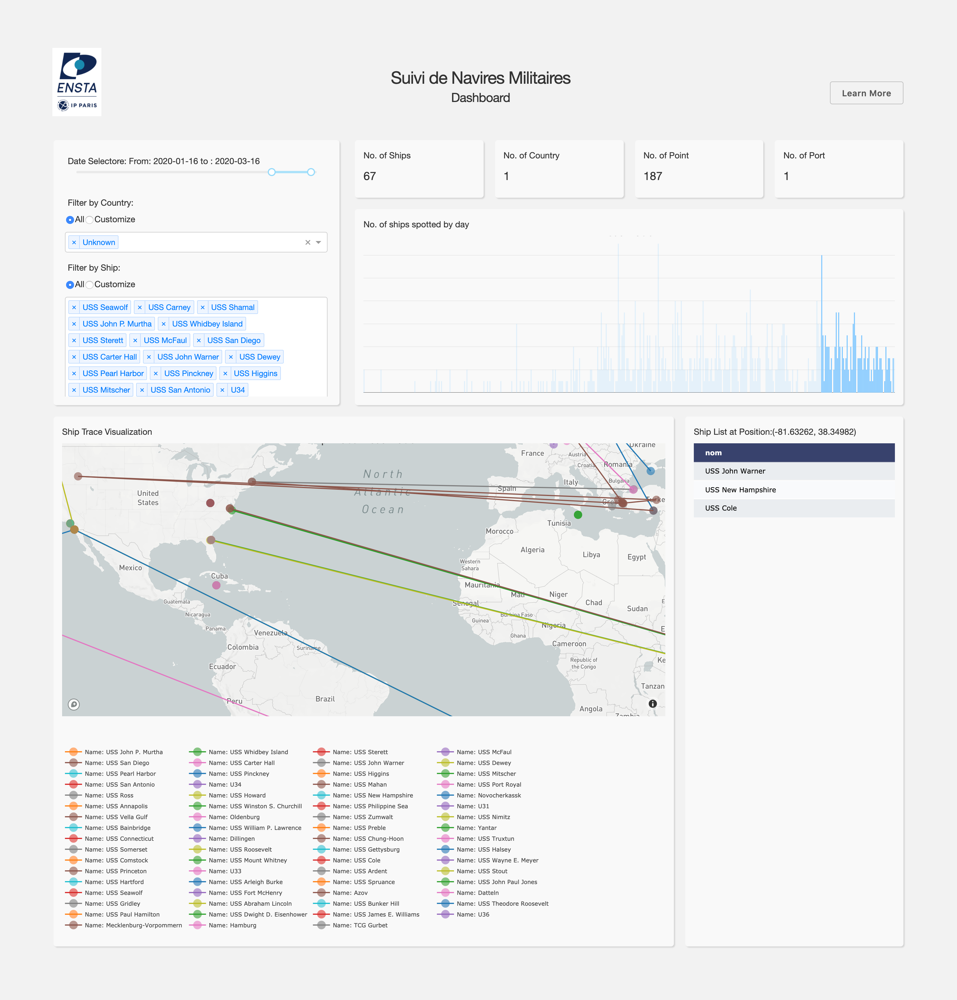

# suivi_navires

Projet "Suivi de navires militaires par approche multimodale et sources ouvertes".

## Usage
### Install dependencies

```
sudo apt install yajl-tools
pip install -r requirements.txt
python -m spacy download en_core_web_lg
```
For visualization only:
```
pip install -r requirements_visualization.txt
```
### Process tweets
```
export MAPBOX_ACCESS_TOKEN=<Secret Access Token>
./run.sh
```
### visualization
```
python app.py
```

## Screenshot


